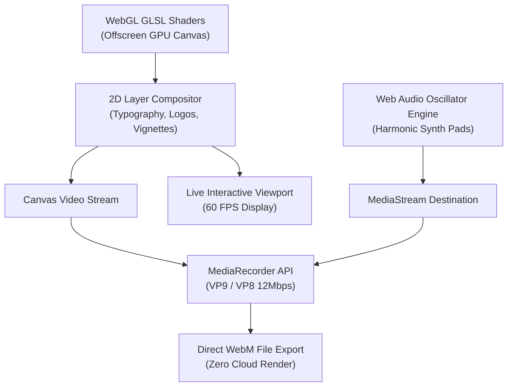

> [!NOTE]
> **FluxFrame v1.0 is live:** High-definition in-browser procedural motion video rendering, WebGL GLSL multi-shader engine, generative Web Audio synthesis, and local client-side WebM export.

<div align="center">

# ❖ FluxFrame Studio
### Browser-Native Procedural Motion Video Generator

An autonomous, GPU-accelerated video generator that runs entirely inside your browser. No server rendering, no cloud upload, and zero video editing timelines required.

[](https://github.com/jojin1709)
[](LICENSE)
[](https://github.com/jojin1709/motion-canvas-studio-)
[](https://vercel.com/new)

<p><strong>Launch Locally in 5 Seconds</strong></p>

```bash
npx serve .
```

<sub>Open in Chrome, Edge, Brave, or Firefox. No compilation or dependencies needed.</sub>

---

</div>

> [!TIP]
> **Production Ready:** FluxFrame is 100% static. You can deploy it to **Vercel**, **Cloudflare Pages**, or **GitHub Pages** instantly without provisioning backend compute or databases.

---

## Table of Contents

- [What is FluxFrame?](#what-is-fluxframe)
  - [Why FluxFrame Exists](#why-fluxframe-exists)
  - [Zero Server Video Generation](#zero-server-video-generation)
- [Key Capabilities](#key-capabilities)
- [Visual Style Systems](#visual-style-systems)
- [Architecture](#architecture)
- [Quick Start](#quick-start)
  - [Prerequisites](#prerequisites)
  - [Running Locally](#running-locally)
- [Deploy to Vercel](#deploy-to-vercel)
- [Common Questions](#common-questions)
- [Developer](#developer)
- [License](#license)

---

## What is FluxFrame?

FluxFrame is an open-source, client-side motion graphics studio designed to turn text, visual styles, and assets into cinematic videos with zero video editing experience.

Unlike conventional video editors (Premiere, After Effects, CapCut), FluxFrame is an **autonomous procedural motion generator**. You pick a visual system, configure your copy, customize duration/aspect ratio, and let your local GPU render and export high-bitrate WebM video directly to your downloads folder.

<a id="why-fluxframe-exists"></a>
<details>
<summary><strong>Why FluxFrame Exists</strong></summary>

Rendering video traditionally requires heavyweight video editing software or expensive cloud rendering APIs (FFmpeg workers, AWS Lambda clusters). 

FluxFrame shifts the entire render pipeline directly into the client's web browser using **WebGL fragment shaders** and the **HTML5 MediaRecorder API**, eliminating cloud rendering costs and latency completely.

</details>

<a id="zero-server-video-generation"></a>
<details>
<summary><strong>Zero Server Video Generation & Privacy</strong></summary>

Because rendering happens locally via your GPU:
- **No data is uploaded**: Your titles, subtitles, uploaded logos, and generated videos never touch a remote server.
- **Instant previewing**: Real-time 60 FPS viewport with live timeline scrubbing.
- **No subscription or API keys**: Runs offline without external service dependencies.

</details>

---

## Key Capabilities

- **Multi-Shader GPU Engine**: 4 distinct procedural shaders programmed directly in hardware-accelerated GLSL.
- **2D Layer Compositor**: Kinetic typography, optical drop shadows, studio lighting, vignettes, and logo overlays.
- **Generative Web Audio Synthesis**: Procedural harmonic ambient pads synthesized with Web Audio API and embedded directly into the video stream.
- **Multi-Format Export**: One-click switching between `16:9` (Landscape), `9:16` (Story / Reels / TikTok), and `1:1` (Square).
- **Logo & Watermark Embedding**: Upload any PNG or SVG to composite into the title sequence.
- **Interactive Timeline Scrubber**: Drag and scrub to any second of the scene.
- **High-Bitrate Video Recording**: Direct VP9/VP8 container encoding via `canvas.captureStream()`.

---

## Visual Style Systems

| Style | Aesthetic | Shader Characteristics |
| :--- | :--- | :--- |
| **Silk Flow** | Luxury Apple/Stripe-inspired | Fluid organic gradient mesh with dynamic light refraction and center ambient glow |
| **Obsidian** | Darkroom Cinematic Studio | Deep moody backdrop with moving bokeh spheres and soft atmospheric lighting |
| **Prism Glass** | Iridescent Modernism | Refractive caustic sweep with subtle spectral chromatic dispersion |
| **Editorial** | Clean Architectural Minimal | Sleek dual-tone vertical gradient with precision light beam sweep |

---

## Architecture

FluxFrame combines hardware WebGL fragment shading with a 2D composite layer and audio destination stream:



---

## Quick Start

### Prerequisites
- Any modern web browser (Google Chrome, Microsoft Edge, Brave, Firefox, Safari).
- Any local static file server (e.g. Node.js `serve` or Python `http.server`).

### Running Locally

```bash
# Clone the repository
git clone https://github.com/jojin1709/motion-canvas-studio-.git
cd motion-canvas-studio-

# Run with Node.js
npx serve .

# Or run with Python
python -m http.server 3000
```

Open `http://localhost:3000` in your browser.

---

## Deploy to Vercel

FluxFrame contains a pre-configured [vercel.json](vercel.json) with security headers, clean URLs, and static asset caching.

### Option 1: Vercel CLI
```bash
npx vercel
```

### Option 2: GitHub Dashboard
1. Push this repository to your GitHub account.
2. Go to [vercel.com/new](https://vercel.com/new).
3. Import **`motion-canvas-studio-`** and click **Deploy**.

---

## Common Questions

### Is Cloudflare or a backend server needed?
**No.** FluxFrame is 100% client-side HTML, CSS, JavaScript, and WebGL. It runs entirely inside the user's browser, meaning you only need standard static hosting (like Vercel, Netlify, or GitHub Pages).

### How does video export work without FFmpeg?
FluxFrame captures the active canvas frame buffer using `canvas.captureStream(30)` and pairs it with the synthesized Web Audio track using the browser's native `MediaRecorder` API to create a high-quality `.webm` file.

### Can I add custom fonts or visual effects?
Yes! Fonts can be loaded via Google Fonts in `index.html`, and new GLSL shaders can be added directly inside `shaders` in `app.js`.

---

## Developer

**Developed and engineered by [JOJIN JOHN](https://github.com/jojin1709)**

---

## License

This project is licensed under the **[MIT License](LICENSE)**. Feel free to use, modify, and distribute it for personal or commercial projects.
