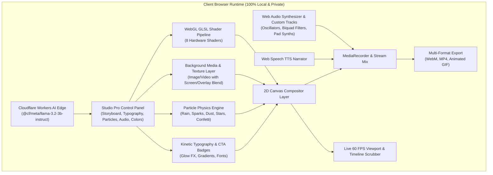

# ❖ FluxFrame Studio Pro
### Real-Time Procedural Motion Video Generator & AI Storyboard Engine

An autonomous, GPU-accelerated motion graphics engine that runs entirely inside your browser. No server rendering queues, no cloud tracking, zero data retention, and no complex video editing timelines required.

[](https://fluxframe-studio.pages.dev/)
[](https://developers.cloudflare.com/workers-ai/)
[](https://github.com/jojin1709)
[](LICENSE)
[](https://github.com/jojin1709/motion-canvas-studio-)

<p align="center">
  <strong><a href="https://fluxframe-studio.pages.dev/" target="_blank">🚀 Launch Live Studio: https://fluxframe-studio.pages.dev</a></strong>
</p>

```bash
# Run locally in seconds
git clone https://github.com/jojin1709/motion-canvas-studio-.git
cd motion-canvas-studio-
npx serve .
```

---

## 🌟 Overview & Key Features

FluxFrame Studio Pro shifts the entire video production pipeline directly into the client's browser using **hardware-accelerated WebGL fragment shaders**, **2D canvas kinetic typography compositing**, **Web Audio API harmonic synthesis**, and the **HTML5 MediaRecorder API**.

### 🎬 Studio Pro Capabilities

1. **Multi-Scene Storyboard Sequence Builder**:
   - Create multi-chapter sequential video presentations with independent styles, typography, particles, and durations per scene.
   - Real-time tab switching, adding (`+ Add Scene`), reordering, and deleting scenes.
   - Unified timeline scrubber and sequential multi-scene video encoding.

2. **8 Procedural GLSL Shaders**:
   - **Silk Flow**: Luxury Apple fluid mesh with organic color diffusion.
   - **Solar Flare**: Blazing fiery orange-gold rays, plasma core, and solar flares.
   - **Cosmic Aurora**: Emerald & cyan northern lights ribbons with stardust.
   - **Cyber Wave**: Vibrant synthwave 3D neon grid with retro sun horizon.
   - **Liquid Chrome**: Reflective metallic mercury ripples with specular reflections.
   - **Obsidian Darkroom**: Cinematic deep moody studio with bokeh spheres.
   - **Prism Glass**: Holographic optical caustics with chromatic dispersion.
   - **Warp Speed**: Relativistic hyperspace tunnel with radial velocity rays.

3. **Cloudflare Workers AI Prompt-to-Scene Generator**:
   - Natural language prompt parsing powered by `@cf/meta/llama-3.2-3b-instruct` on Cloudflare Workers AI edge.
   - 100% private local fallback engine for offline prompt generation.

4. **Multi-Layer Background Texture & Video Layer**:
   - Upload custom background photos (`.png`, `.jpg`, `.webp`) or video loops (`.mp4`, `.webm`).
   - 6 procedural shader blend modes (*Screen*, *Overlay*, *Normal*, *Multiply*, *Color Dodge*, *Soft Light*).
   - Built-in procedural textures: Atmospheric Smoke, 3D Wireframe Grid, Prism Light Leaks, and Soft Gold Bokeh.
   - Adjustable layer opacity and blur filters.

5. **Gradient Headlines & Text Glow FX**:
   - 6 curated typographic gradient fills: *Sunset Flame*, *Cyber Neon*, *Deep Aqua*, *Liquid Chrome*, *Prism Rainbow*, and *Solid Accent*.
   - Configurable neon glow intensity (*12px Subtle*, *26px Vibrant*, *48px Hyper Beam*, *Clean*).

6. **Procedural Atmospheric Particle Engine**:
   - Physics-driven particle overlays running on top of WebGL shaders:
     - 🌧️ *Falling Raindrops & Mist*
     - ✨ *Floating Cosmic Dust*
     - ⚡ *Cyber Glitch Sparks*
     - 🌌 *Starfield Warp Speed*
     - 🎉 *Celebration Confetti*

7. **Animated Call-to-Action (CTA) Badges**:
   - Pulsing high-contrast action pills: `📲 Download App`, `🔗 Link in Bio`, `🔥 Shop Now (50% OFF)`, `▶️ Subscribe & Follow`, `🚀 Register Free`, and `👆 Swipe Up`.

8. **AI Speech Synthesis Voiceover (TTS)**:
   - Automated real-time narration of scene headlines during playback and sequence export with selectable *Cinematic* and *Studio* voices.

9. **One-Click Studio Templates Library**:
   - Pre-configured presets for popular social formats:
     - 📱 *TikTok / Reels Hook (9:16)*
     - 🎬 *YouTube Cinematic Intro (16:9)*
     - 🎵 *Spotify Canvas Loop (9:16)*
     - 🚀 *Tech Product Launch (16:9)*
     - 🌧️ *Midnight Rain Lo-Fi (16:9)*
     - 🔥 *Solar Keynote Summit (16:9)*
     - ⚡ *Cyberpunk Synthwave (16:9)*
     - 💎 *Luxury Brand Editorial (1:1)*
     - 🎙️ *Dark Podcast Clip (1:1)*

10. **Multi-Format Video & Animated GIF Export**:
    - Direct client-side video encoding in **WebM (VP9/Opus)**, **MP4**, and **Animated GIF** formats.

11. **Cloudflare Turnstile Bot Verification**:
    - Integrated security check for bot protection with 0% user data collection.

---

## 🏗️ Architecture



---

## 🚀 Quick Start

### Prerequisites
- Any modern web browser with WebGL 2.0 support (Chrome, Edge, Brave, Firefox, Safari).
- Node.js (v18+) or Python for local preview.

### Running Locally

```bash
# 1. Clone the repository
git clone https://github.com/jojin1709/motion-canvas-studio-.git
cd motion-canvas-studio-

# 2. Run local development server
npx serve .
```

Open `http://localhost:3000` in your browser.

---

## ☁️ Deployment

### Cloudflare Pages (Recommended)

FluxFrame includes native Cloudflare Pages Functions (`/functions/api/ai.js`):

```bash
# Deploy with Wrangler CLI
npx wrangler pages deploy . --project-name=fluxframe-studio
```

### Vercel / Netlify / GitHub Pages

Because FluxFrame is static HTML5/JS with client-side WebGL, it can be deployed to any static host without configuration.

---

## 🔒 Privacy & Zero Data Retention

- **No Remote Video Processing**: All frames are rendered locally on your device's GPU.
- **No File Upload to Cloud Servers**: User-uploaded logos, images, audio, and videos remain strictly inside browser memory (`Blob` / `FileReader`).
- **No Tracking**: No telemetry, analytics, or user profiling cookies.

---

## 👨‍💻 Developer & Credits

**Developed and engineered by [JOJIN JOHN](https://github.com/jojin1709)**

- GitHub: [@jojin1709](https://github.com/jojin1709)
- Repository: [https://github.com/jojin1709/motion-canvas-studio-](https://github.com/jojin1709/motion-canvas-studio-)

---

## 📄 License

This project is licensed under the **[MIT License](LICENSE)**. Feel free to use, customize, and build commercial projects with FluxFrame Studio Pro.
